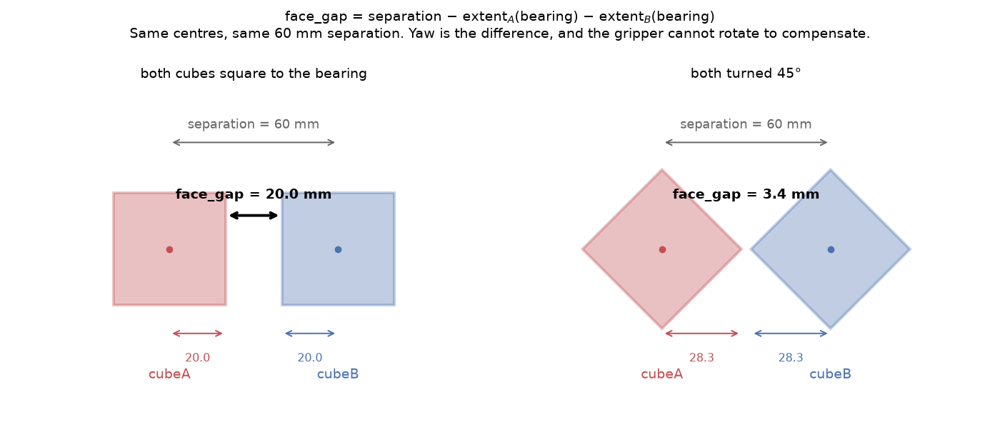
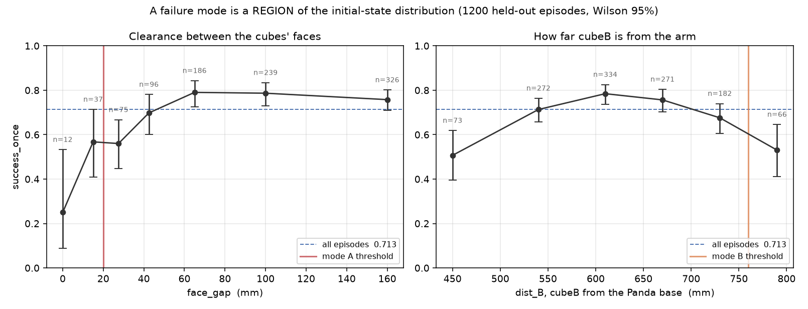

# T-II — how the failure modes are demonstrated

This directory answers one question: **does the trained policy fail
systematically in identifiable regions of the initial-state distribution, and by
how much?**

The deliverable is the assignment's:

> Report per-failure-mode success rates of the base policy over 100 rollouts and
> 3 seeds by running evaluations in the identified failure episode
> configurations.

Read this file top to bottom and you will know which code finds the episodes,
which code runs the policy on them, and which code turns the outcomes into
numbers you can defend.

---

## 0. What a failure mode is here

A failure mode is **a region of the initial-state distribution**, not a list of
bad episodes.

That distinction is the whole method. A list of bad episodes cannot be checked —
quoting the failure rate of the episodes you picked *because* they failed
measures nothing but your own selection. A region can be **resampled**: state
the region in advance, draw fresh episodes from it that nothing has ever been
measured on, and report the rate there. The episodes that identified the region
and the episodes that measure it are then disjoint, and the number means
something.

Everything below is machinery for making that resampling cheap and checkable.

### The two modes

Both were found in a 1,200-episode held-out pass (`results/nominal.csv`) and
both fail at a **different stage** by a **different mechanism** — which is what
makes them two modes rather than two slices of one curve.

| | region | n | success | grasped | placed | held \| placed |
|---|---|--:|--:|--:|--:|--:|
| — | *nominal reference* | 1200 | 0.713 | 0.984 | 0.884 | 0.807 |
| **A** | `face_gap < 20 mm`, `dist_max < 760 mm` | 44 | **0.523** | 0.955 | **0.659** | 0.793 |
| **B** | `dist_B ≥ 760 mm`, `dist_A < 720 mm`, `face_gap ≥ 50 mm` | 41 | **0.561** | **1.000** | 0.854 | **0.657** |

- **Mode A — the cubes' faces are close.** Placement collapses (0.659 against
  0.884) while hold-given-placement is normal. The arm grasps cubeA fine and then
  cannot get it onto cubeB: the descent fouls the neighbouring cube.
- **Mode B — cubeB is at the edge of the workspace.** Grasping is *perfect*
  (1.000) and placement is near baseline, then hold-given-placement collapses
  (0.657 against 0.807). The arm gets there; the stack does not stay.

The two regions are **disjoint** — 0 of 1,200 episodes satisfy both — so the two
numbers are independent measurements rather than the same episodes counted twice.

---

## 1. Defining the region — `geometry.py`

**The file:** [`geometry.py`](geometry.py). Imports `math` and nothing else — no
numpy, no torch, no simulator. It runs on any machine, and
[`test_geometry.py`](test_geometry.py) checks it in about a second.

### `face_gap` — what "the cubes are close" actually means

Centre-to-centre `separation` is the obvious axis and it is the wrong one,
because a 40 mm cube does not present 40 mm from every direction — across its
diagonal it presents 56.6 mm. Two cubes 60 mm apart are comfortably clear when
square to each other and nearly touching when both are turned 45°.

So the axis is the clearance between the cubes' **faces**, resolved along the
bearing from A to B:

```python
def geom_features(ax, ay, tha, bx, by, thb, h=CUBE_HALF):
    psi = math.atan2(by - ay, bx - ax)          # bearing from A to B
    sep = math.dist((ax, ay), (bx, by))
    return dict(
        face_gap=sep - half_extent(psi - tha, h) - half_extent(psi + math.pi - thb, h),
        ...)

def half_extent(delta, h=CUBE_HALF):
    return h * (abs(math.cos(delta)) + abs(math.sin(delta)))   # h at 0°, h·√2 at 45°
```



Both yaws enter, each resolved against the bearing. This is why `relative_yaw`
on its own predicts nothing: a yaw is not a scalar you can regress against
without a direction to resolve it in.

`face_gap` can go **negative** — the sampler's 58.6 mm centre-separation floor
does not stop two diagonally-presented cubes from overlapping along the bearing.
That is meaningful, not a bug, and it is not clamped.

**Why this matters mechanically:** under `pd_ee_delta_pos` the action is padded
with three zeros and `compute_target_pose` keeps the current rotation
(`pd_ee_pose.py:86-99`), so the gripper's orientation is **frozen at reset for
all 200 steps**. Cube yaw is uniform on [0, 2π). The policy therefore meets
cubes at every misalignment with equal probability and *cannot rotate to
compensate*. Mode A is that fact, measured.

### `dist_A` / `dist_B` — reach, from the arm

Measured from the Panda's base at `(-0.615, 0)` (`scene_builder.py:103,123`),
not from the world origin. Getting this wrong once reversed the sign of a
conclusion, so it is a named constant with a citation.

### The modes themselves

```python
MODES = {
    "gap":  lambda g: g["face_gap"] < 0.020 and g["dist_max"] < 0.76,
    "farb": lambda g: (g["dist_B"] >= 0.76 and g["dist_A"] < 0.72
                       and g["face_gap"] >= 0.05),
    "nominal": lambda g: True,
}
```

Each mode carries exactly **one control, and it excludes the other mode's
factor**:

- `gap`'s `dist_max < 0.76` keeps far-reach episodes (mode B's factor) out.
- `farb`'s `face_gap >= 0.05` keeps tight-clearance episodes (mode A's factor)
  out.
- `farb`'s `dist_A < 0.72` excludes the **both-cubes-far corner**, where grasping
  breaks down kinematically (0.815 above 740 mm) and no bounded residual can
  recover a target the IK cannot reach. Excluded rather than left in to depress
  the result, because T-IV is scored on this region.

Without those controls the two regions overlap and neither rate measures its own
mechanism. `dist_max < 0.76` and `dist_B >= 0.76` are mutually exclusive, so
disjointness is structural — asserted analytically *and* against the committed
data in `test_geometry.py`.

The thresholds are **pre-registered**: written into `geometry.py` and
`notes/t2-failure-modes.md`, together with the rate each must reproduce
(`DISCOVERY`), before any confirmation rollout ran. A threshold fixed in advance
is a materially stronger claim than one chosen after seeing the scatter.

### That these are regions at all



Success against `face_gap` runs 0.25 → 0.79 monotonically; against `dist_B` it is
an inverted U. Both from the same 1,200 held-out episodes, Wilson 95% intervals.

---

## 2. Finding the seeds — `seed_index.py`

**The file:** [`seed_index.py`](seed_index.py). No policy, no GPU, minutes.

`reset(seed=s)` is deterministic — `_initialize_episode` runs under
`torch.random.fork_rng()` with `manual_seed(_episode_seed)`
(`sapien_env.py:950-953`). So:

> **A seed is a lossless 8-byte encoding of the entire initial state.**

which means the map from seed to cube poses can be tabulated with **resets
alone** — no policy, no 200-step rollout, no GPU:

```python
for s in range(START, START + N):
    env.reset(seed=s)
    row = dict(seed=s, **cube_features(*poses(env)))     # -> seeds.csv
```

That turns *"resample fresh episodes from the failure region"* into **rejection
sampling over integers**: filter `seeds.csv` for the region, hand the surviving
seeds to the evaluator. The episodes that come back are drawn from exactly the
environment's own conditional distribution given the region — no state injection,
no distribution shift, and every episode reproducible from one integer.

The alternative, injecting poses via `options={"reset_to_env_states": ...}`,
replaces `_initialize_episode` wholesale (robot qpos and table pose would have to
be synthesised too) and broadcasts identically to every worker under
`AsyncVectorEnv`. That is a T-III tool, where a biased distribution is the goal.

`seed_index.py` also prints, for free, whether the index can actually **fill** an
evaluation — `farb` hits ~3.4% of eligible seeds, so 300 of them need ~9,000 to
draw from. Finding that out costs seconds here and an hour if you find it out
during the rollouts.

### Which seeds are allowed

```
[0, 1000)      demonstrations   training initial states — NEVER evaluate here
[1000, 2200)   discovery        the 1,200-episode nominal pass (done)
[6000, 6300)   T-I              the 3 × 100 T-I deliverable (done)
[10000, ...)   EVAL_BASE        everything eval_modes.py draws
```

Two separate requirements, and the second has bitten this repo for real:

1. **Passes must be disjoint from each other.** Re-measuring a region on the
   episodes that identified it measures noise.
2. **Every pass must be disjoint from the demonstrations.** Motion-planning demos
   are generated from consecutive seeds starting at 0
   (`motionplanning/panda/run.py:44-101`), ~990 replayed and 800 trained on. Same
   checkpoint, measured both ways: **0.910 on seeds 0–299 versus 0.713 held
   out.** That gap is memorisation, not a success rate.

`EVAL_BASE = 10000` sits above every block already measured, so the new draws
cannot collide with anything. The previous harness selected from seed ≥ 2200 and
needed ~5,000 eligible seeds to fill a region — which reached straight through
T-I's `[6000, 6300)` block and silently pulled in 20 of its seeds.

---

## 3. Running the policy on them — `eval_modes.py`

**The file:** [`eval_modes.py`](eval_modes.py). This is the deliverable.

```bash
python t2/eval_modes.py CKPT --modes nominal gap farb \
       --index seeds.csv --out $T2_OUT --episodes 100 --blocks 3
```

### What "100 rollouts × 3 seeds" means

**Three disjoint blocks of 100 region seeds, block *b* run under policy seed
*b*.** The three rates are independent estimates and their spread is a real
error bar.

The tempting alternative — one block of 100 evaluated three times under three
policy seeds — holds the initial states fixed and measures only DDPM sampling
noise, which is a much smaller quantity. That is not what "3 seeds" means, and
`verify.py` check 6 refuses it.

A `nominal` arm runs in the **identical shape**, so the reference the modes are
compared against is structurally the same measurement rather than an assembled
one. It is also the arm T-IV needs for "near-zero degradation on the nominal
distribution".

### Seed allocation is disjoint by construction

```python
taken, out = set(), {}
for tag in modes:                       # fixed order, one shared pool
    hits = [s for s, g in pool if s not in taken and MODES[tag](g)]
    out[tag] = hits[:n_per_mode]
    taken |= set(out[tag])
```

The pool starts above `EVAL_BASE` with every reserved block removed, and shrinks
as modes take from it. Two blocks cannot share an episode because the pool never
offered one twice — the property is removed rather than checked for afterwards.

### The four assertions, per episode, before a single step

This is the part that makes the script *verifiable* rather than merely correct.
They run at reset, and any violation aborts naming the seed:

```python
def check_episode(tag, seed, a_pose, b_pose, got_seed, index_row, used):
    if got_seed != seed:            die(...)   # 1. the env reset where we asked
    if reserved_hit(seed):          die(...)   # 2. not a demo / T-I / discovery seed
    if seed in used:                die(...)   #    and not already used
    feats = cube_features(a_pose, b_pose)
    #  3. these poses match the independently built index, to 1e-5
    #  4. this initial state IS in the region — recomputed from what the env
    #     actually produced, not from the index row that selected it
    if not MODES[tag](feats):       die(...)
```

Each closes a specific hole:

1. A seed that silently fails to take would make every episode describe a
   different initial state than the region was selected on.
2. and its neighbour keep evaluation off the training set and off previously
   measured blocks.
3. `seed_index.py` and `eval_modes.py` reach the simulator by **different
   paths**. Agreement means the seed→state map is genuine and deterministic.
4. A selection bug would file episodes under a mode they do not belong to, and
   the per-mode rate would be a rate over the wrong population.

**No episode that fails any of these is ever written to a CSV** — because a CSV
row is what a report quotes.

### What comes out

One row per episode, schema fixed in `geometry.COLUMNS`, plus a manifest
carrying the checkpoint's SHA-256, the GPU model, and the git revisions:

```
run_id, mode, block, policy_seed, seed,
cubeA_x/y/theta, cubeB_x/y/theta, separation, relative_yaw, relative_yaw_mod90,
face_gap, dist_A, dist_B, dist_max, dist_min,
success_once, success_at_end, ep_len,
ever_grasped, ever_placed, ever_static,
final_cubeA_x/y/z, cubeB_displacement
```

`ever_grasped` / `ever_placed` / `ever_static` come free from `evaluate()`'s
info dict and are what turn a binary failure into a **mechanism**.
`cubeB_displacement` — how far cubeB was shoved during the episode — measures
mode A's proposed mechanism directly.

---

## 4. The statistics

**`success_once`** is the reported number: the task succeeded at *any* step.
`make_eval_envs` sets `ignore_terminations=True` so every episode runs the full
horizon, and `CPUGymWrapper(record_metrics=True)` nests the real value under
`info['episode']`. The top-level `info['success']` is the **final-step** value —
`success_at_end` — and reading it by mistake is a bug this repo has already
shipped once. Both are logged.

Three numbers per mode:

- **mean ± SD over the three blocks.** The SD is the error bar the 3-seed
  structure exists to buy.
- **a pooled Wilson 95% interval** over all 300. Wilson rather than
  `sqrt(p(1-p)/n)`: at n≈100 the interesting bins sit near p = 0, where the
  normal interval runs below zero and claims certainty it does not have. A 0/20
  bin gets ±0.000 from the normal formula and [0, 0.161] from Wilson.
- **the stage decomposition** — grasped → placed → held-given-placed. This is
  what separates the two modes, and it is the part T-II is really graded on.

`figures/t2_modes.png` carries both panels — the three per-mode rates with
their Wilson intervals and the three block rates overlaid, and the stage
decomposition beside it. It is written by `run.sh report`, so it appears once
the evaluation in step 3 has run.

---

## 5. Checking it

Three tools, three different holes. All but one run on a laptop with no
simulator.

| | what it proves | cost |
|---|---|---|
| [`test_geometry.py`](test_geometry.py) | the definition of a failure mode is right — `face_gap` against hand-computed cases, the 4-fold yaw symmetry, mode disjointness, and that the `DISCOVERY` table matches the CSV it was quoted from | ~1 s, no deps |
| [`test_verify.py`](test_verify.py) | **the checker actually catches things** — fabricates a valid pass, then corrupts it twelve ways and confirms each is caught | ~2 s, no deps |
| [`verify.py`](verify.py) | the finished evaluation is what it claims | ~1 s, no deps |
| [`policy_check.py`](policy_check.py) | the actions came from **these weights**, by racing them against untrained / random / zero | ~4 min, needs the sim |

`verify.py` is the gate. It exits non-zero, so a report can depend on it:

1. no block touches a reserved seed range
2. every CSV header is exactly `geometry.COLUMNS` *(fatal — every later check
   reads by name)*
3. all nine blocks are pairwise disjoint
4. every episode satisfies its mode's filter, **recomputed** from the logged
   poses rather than read off the stored columns
5. the stored geometry columns agree with that recompute
6. every logged initial state matches the independent seed index
7. one checkpoint SHA behind every block
8. the shape is 3 blocks × 100 episodes × 3 distinct policy seeds

Check 6 is the strongest one available offline and it is free. The poses in an
evaluation CSV were read out of the *environment* at reset; the poses in
`seeds.csv` were produced by a separate policy-free script. Their agreeing
proves three things at once — the env reset to the seed requested, the seed→state
map is deterministic, and the filter selected seeds whose *actual* states satisfy
the condition. One join, no simulator.

`policy_check.py` closes the one hole `verify.py` cannot see offline: a harness
that silently fell back to random actions would still produce a CSV whose initial
states cross-check perfectly.

---

## 6. Reproducing it

```bash
source /workspace/ripl/env.sh
bash setup/apply_patches.sh          # setup_runpod.sh re-clones and wipes it
tmux new -s t2
bash t2/run.sh all 2>&1 | tee ~/t2.log
```

No `CKPT=` needed: the frozen base policy is committed at
`checkpoints/stackcube_rgb_spatial_800demos.pt` and `run.sh` defaults to it, so
this works on a fresh pod with nothing rsynced. Set `CKPT=...` to evaluate some
other checkpoint — it always wins. Check the `visual encoder: spatial (8x8 map
kept)` line in the output rather than the path; `harness.inspect_ckpt` infers
the variant from the weights.

| stage | what | cost |
|---|---|---|
| `test` | the two self-tests | ~3 s |
| `index` | seed → initial state, 25,000 seeds | ~5 min, no GPU |
| `check` | trained weights vs untrained / random / zero | ~4 min |
| `smoke` | 2 episodes through the whole rollout path | ~1 min |
| `eval` | **the deliverable** — 900 episodes, 3 modes × 3 × 100 | ~27 min |
| `verify` | the gate | ~1 s |
| `report` | tables and figures | ~10 s |

`smoke` exists because the rollout path is the one part of this harness that
**cannot be exercised off-pod** — there is no ManiSkill on a laptop. That is
exactly the category the one real crash in the old harness fell into (a stale
hardcoded CSV header, found at minute three of a long job). It writes to
`$OUT/smoke`, deliberately separate, so its 2-episode CSVs cannot be mistaken
for finished blocks by the resume logic.

Resumable: every stage skips work already done, and `eval` never overwrites a
finished block, because rollouts are stochastic and anything clobbered is gone.
`FORCE=1` overrides that, deliberately.

**The run is reportable only if `verify` exits 0.**

On a laptop, without a pod, against the committed evidence:

```bash
python3 t2/test_geometry.py
python3 t2/test_verify.py
nix-shell -p "python3.withPackages(ps: [ps.numpy ps.matplotlib])" \
  --run "python3 t2/report.py --discovery t2/results/nominal.csv"
```

Pull before stopping the pod — figures and manifests do not come back through
git: `bash setup/transfer.sh info`.

---

## The files

| | |
|---|---|
| `geometry.py` | what a failure mode **is**. Pure stdlib. The modes, the geometry, the seed blocks, the CSV schema, Wilson. |
| `harness.py` | the simulator half: checkpoint loading, env construction, ground truth across the subprocess boundary. |
| `seed_index.py` | seed → initial state, policy-free. |
| `eval_modes.py` | **the deliverable.** 100 rollouts × 3 seeds, per mode. |
| `verify.py` | asserts a finished pass is what it claims. Exits non-zero. |
| `report.py` | the tables and the three figures. |
| `policy_check.py` | proves the rollouts are driven by the trained weights. |
| `record_seeds.py` | mp4s for named seeds, retried until the outcome matches. |
| `run.sh` | the driver. `test \| index \| check \| eval \| verify \| report \| videos \| all` |
| `test_geometry.py`, `test_verify.py` | the self-tests. No deps. |
| `results/` | the committed evidence: the seed index and the 1,200-episode discovery pass. |

The weights themselves are at `../checkpoints/` — committed, 33 MB, with the
rationale in `checkpoints/README.md`.

The narrative — what was tried, what was wrong first, and why the axes changed
from `separation` to `face_gap` — is in
[`../notes/t2-failure-modes.md`](../notes/t2-failure-modes.md).
